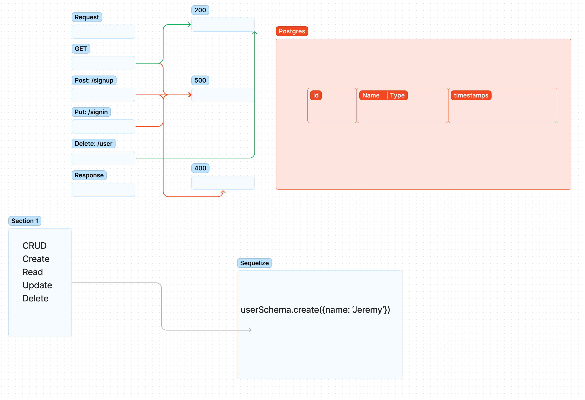

# basic-auth

## Author: Jeremy Cleland

### Problem Domain

 Modularization of provided starter code

### Links and Resources

GitHub Actions
Prod back-end server url

### Setup

DATABASE_URL=postgres://localhost:5432/basic-auth

## How to initialize/run your application (where applicable)

e.g. npm start

## How to use your library (where applicable)

## Features / Routes

### TESTS

How do you run tests? npm test

Describe any tests that you did not complete, skipped, etc N/A

## UML

